[**English**](README.md) | [**中文**](README_zh-CN.md) | **日本語**

<div align="center">

# FreeDoc

**軽量ドキュメントコラボレーションプラットフォーム**

[](LICENSE)
[](https://hub.docker.com/r/tomshushu/free-doc)
[](https://adoptium.net/)
[](https://vuejs.org/)

[機能](#機能) · [クイックスタート](#クイックスタート) · [設定](#設定) · [開発](#開発) · [コントリビュート](#コントリビュート)

</div>

---

## 機能

- 📝 **Markdown エディタ** — リアルタイムプレビュー、シンタックスハイライト、拡張ツールバー、リサイズ可能な分割ペイン
- 👥 **チームコラボレーション** — チームの作成、メンバーの招待、役割による読み書き権限の割り当て
- 📁 **プロジェクト管理** — ディレクトリツリーによるドキュメント管理、ドラッグ＆ドロップ、名前変更対応
- 🔗 **ドキュメント共有** — パスワード保護と有効期限を設定可能な共有リンクの生成
- 📜 **バージョン履歴** — 自動バージョン管理とワンクリックロールバック
- 📤 **多フォーマットエクスポート** — Markdown、HTML、PDF、DOCX 形式でのエクスポート
- 🌍 **多言語対応** — 簡体字中国語、英語、繁体字中国語、日本語、ドイツ語の5言語をサポート
- 🗄️ **デュアルデータベース** — SQLite を内蔵し、本番環境では MySQL に切り替え可能

## 技術スタック

| フロントエンド | バックエンド |
| --- | --- |
| Vue 3.4 + TypeScript | Spring Boot 3.3 + Java 17 |
| Vite 5 | MyBatis-Plus 3.5 |
| Element Plus | Spring Security + JWT |
| Pinia | SQLite / MySQL |
| highlight.js + marked | Caffeine Cache |
| Tailwind CSS | OpenHTMLToPDF / Apache POI |
| vue-i18n | |

## クイックスタート

### Docker を使用する場合（推奨）

```bash
docker run -d \
  --name freedoc \
  -p 9200:9200 \
  -v freedoc-uploads:/app/uploads \
  -v freedoc-data:/app/data \
  tomshushu/free-doc:latest
```

### ソースからビルドする場合

```bash
git clone https://github.com/Tomshushu/free-doc.git
cd free-doc
docker build -t tomshushu/free-doc:latest .
```

起動：

```bash
docker run -d \
  --name freedoc \
  -p 9200:9200 \
  -v freedoc-uploads:/app/uploads \
  -v freedoc-data:/app/data \
  tomshushu/free-doc:latest
```

起動後、`http://localhost:9200` にアクセスしてください。デフォルトの管理者アカウント：

| ユーザー名 | パスワード |
| --- | --- |
| `admin` | `adminadmin` |

> ⚠️ **セキュリティに関するお知らせ**：初回ログイン後、直ちにデフォルトパスワードを変更し、強力な `JWT_SECRET` を設定してください。

## 設定

### 環境変数

環境変数または設定ファイル（`free-doc.conf`）で設定できます。環境変数が設定ファイルより優先されます。

| 変数 | デフォルト | 説明 |
| --- | --- | --- |
| `DB_TYPE` | `sqlite` | データベースタイプ：`sqlite` または `mysql` |
| `SERVER_PORT` | `9200` | サーバーポート |
| `JWT_SECRET` | — | JWT シークレットキー（**必須**、32文字以上のランダム文字列） |
| `DEFAULT_ADMIN_PASSWORD` | `adminadmin` | 初期管理者パスワード |
| `UPLOAD_PATH` | `./uploads` | アップロードファイルの保存パス |
| `UPLOAD_MAX_SIZE` | `52428800` | アップロードファイルサイズ制限（50MB） |

### MySQL 設定

`DB_TYPE=mysql` の場合、追加設定が必要です：

| 変数 | 説明 |
| --- | --- |
| `MYSQL_HOST` | MySQL ホストアドレス |
| `MYSQL_PORT` | MySQL ポート（デフォルト 3306） |
| `MYSQL_DATABASE` | データベース名 |
| `MYSQL_USER` | データベースユーザー名 |
| `MYSQL_PASSWORD` | データベースパスワード |
| `MYSQL_USE_SSL` | SSL を有効にするか（デフォルト true） |

### Docker Compose 例（MySQL）

```yaml
version: '3.8'
services:
  freedoc:
    image: tomshushu/free-doc:latest
    container_name: freedoc
    ports:
      - "9200:9200"
    environment:
      - DB_TYPE=mysql
      - MYSQL_HOST=mysql
      - MYSQL_PORT=3306
      - MYSQL_DATABASE=freedoc
      - MYSQL_USER=freedoc
      - MYSQL_PASSWORD=your_secure_password
      - JWT_SECRET=your_jwt_secret_at_least_32_chars
    volumes:
      - freedoc-uploads:/app/uploads
    depends_on:
      - mysql

  mysql:
    image: mysql:8.0
    environment:
      - MYSQL_ROOT_PASSWORD=root_password
      - MYSQL_DATABASE=freedoc
      - MYSQL_USER=freedoc
      - MYSQL_PASSWORD=your_secure_password
    volumes:
      - mysql-data:/var/lib/mysql

volumes:
  freedoc-uploads:
  mysql-data:
```

### 設定ファイルのマウント

設定ファイルをコンテナにマウント：

```bash
docker run -d \
  --name freedoc \
  -p 9200:9200 \
  -v /path/to/free-doc.conf:/app/config/free-doc.conf \
  -v freedoc-uploads:/app/uploads \
  -v freedoc-data:/app/data \
  tomshushu/free-doc:latest
```

## プロジェクト構造

```
free-doc/
├── free-doc-server/          # バックエンド (Spring Boot)
│   └── src/main/java/com/freedoc/
│       ├── controller/       # REST API コントローラー
│       ├── service/          # ビジネスロジック
│       ├── mapper/           # データアクセス層
│       ├── entity/           # データエンティティ
│       ├── dto/              # データ転送オブジェクト
│       ├── config/           # 設定クラス
│       └── security/         # セキュリティ・認証
├── free-doc-web/             # フロントエンド (Vue 3)
│   └── src/
│       ├── views/            # ページコンポーネント
│       ├── components/       # 共通コンポーネント
│       ├── composables/      # コンポーザブル関数
│       ├── stores/           # Pinia 状態管理
│       ├── i18n/             # 国際化
│       ├── api/              # API リクエスト
│       └── utils/            # ユーティリティ関数
├── db/                       # データベース初期化スクリプト
├── Dockerfile                # マルチステージビルド
├── docker-entrypoint.sh      # コンテナエントリポイント
└── free-doc.conf             # デフォルト設定ファイル
```

## 開発

### 前提条件

- Node.js 20+
- Java 17+
- Maven 3.9+

### フロントエンド開発

```bash
cd free-doc-web
npm install
npm run dev
```

フロントエンド開発サーバーはデフォルトで `http://localhost:5173` で起動します。

### バックエンド開発

```bash
cd free-doc-server
mvn spring-boot:run
```

バックエンドサービスはデフォルトで `http://localhost:9200` で起動します。

> フロントエンド開発時は、`/api` リクエストをバックエンドサービスに転送するプロキシを設定してください。

## スクリーンショット

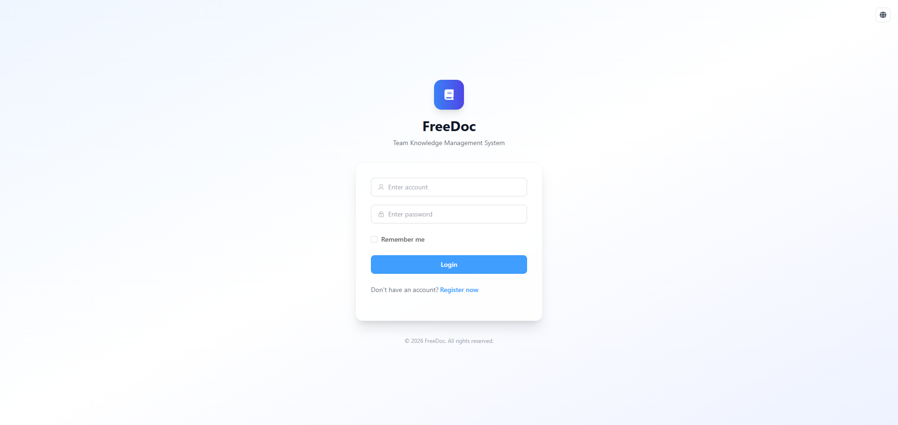
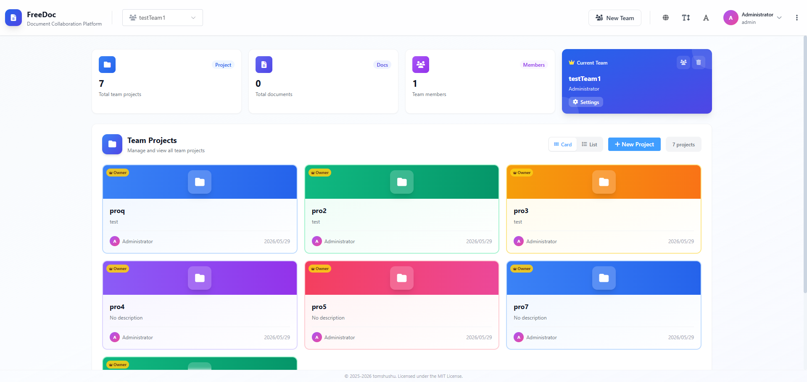
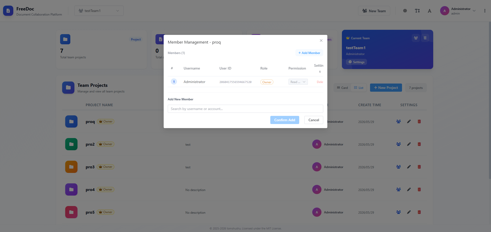
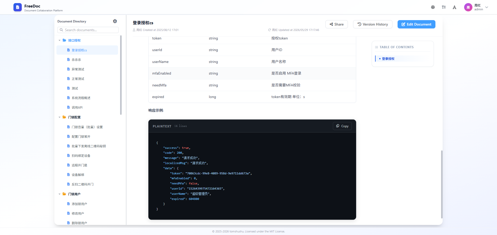
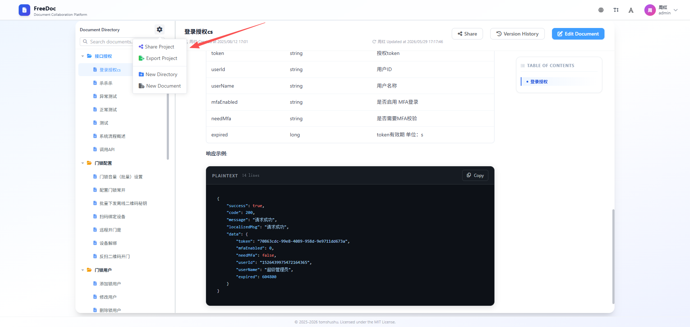
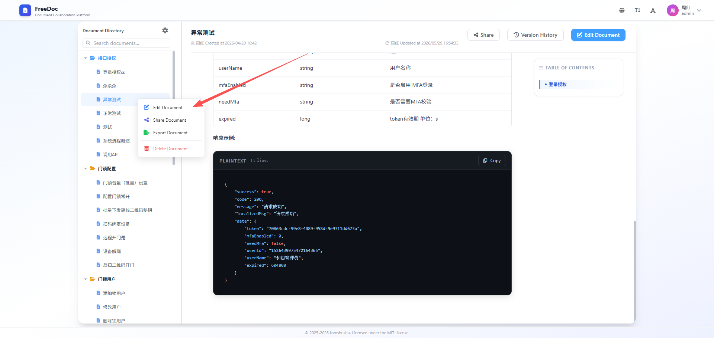
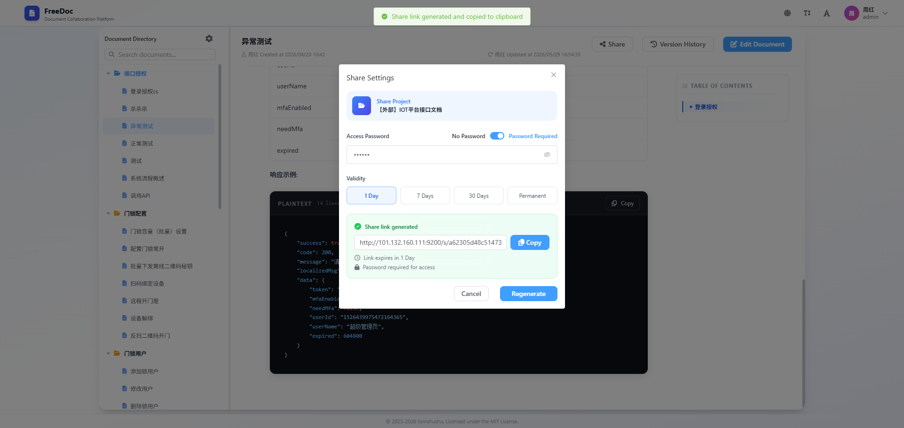
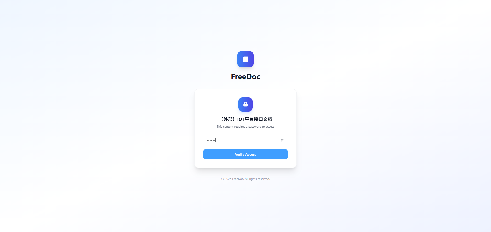
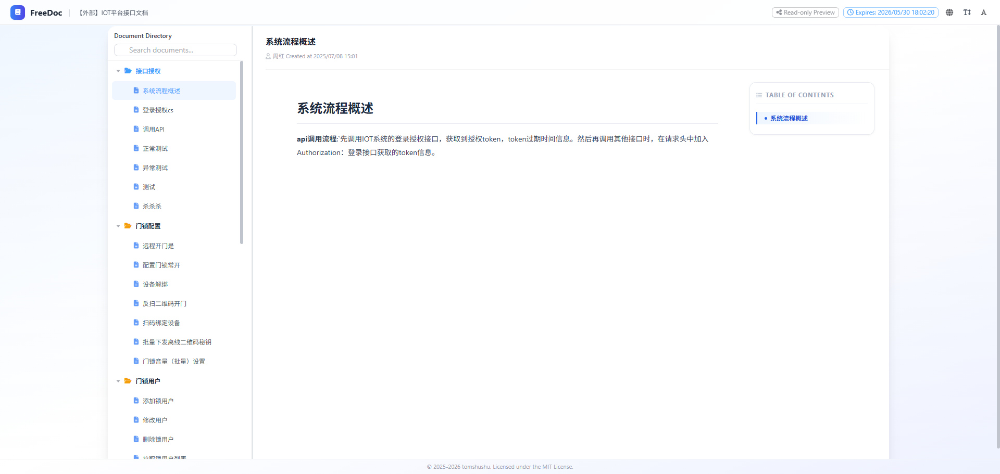

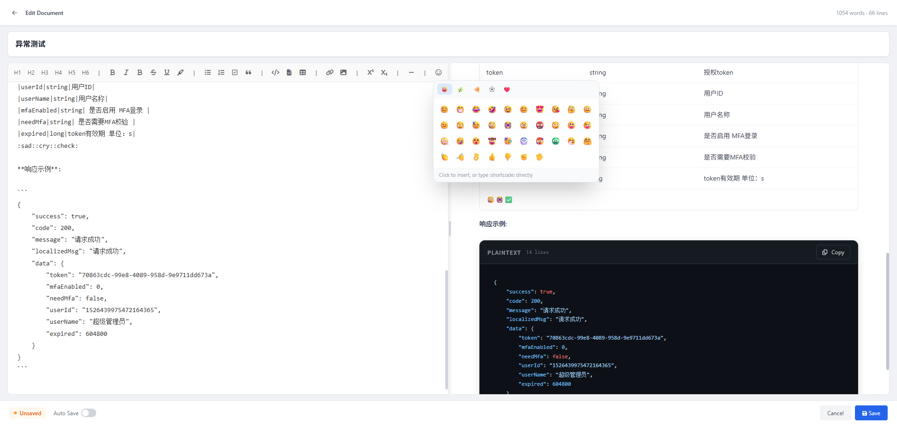

### バージョンロールバック

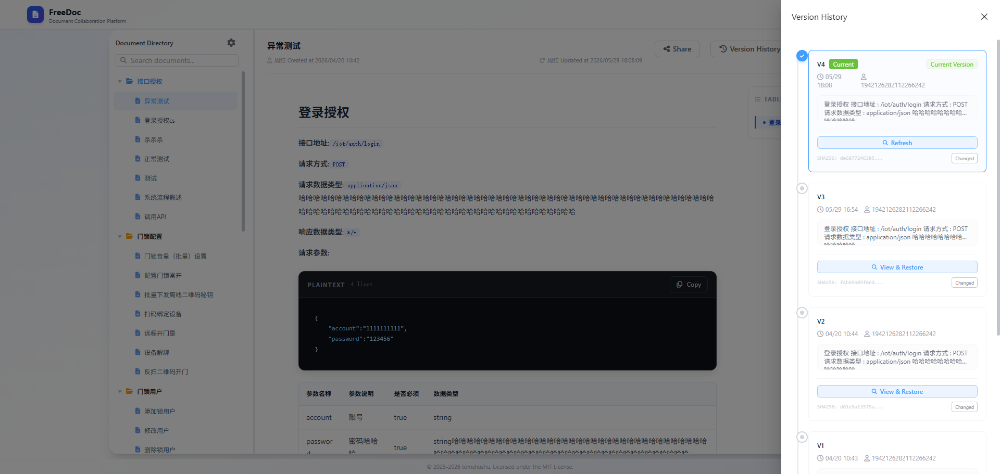
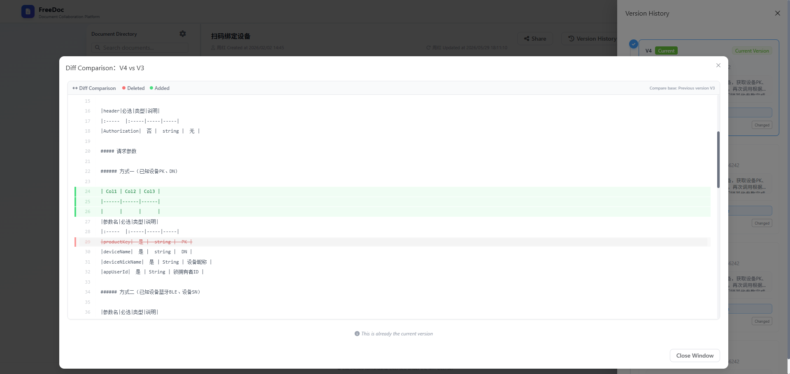

## コントリビュート

コントリビュートを歓迎します！以下の手順に従ってください：

1. リポジトリをフォークする
2. フィーチャーブランチを作成（`git checkout -b feature/amazing-feature`）
3. 変更をコミット（`git commit -m 'Add some amazing feature'`）
4. ブランチにプッシュ（`git push origin feature/amazing-feature`）
5. プルリクエストを作成する

## ライセンス

このプロジェクトは [MIT License](LICENSE) の下で公開されています。

## 謝辞

- [Vue.js](https://vuejs.org/) — プログレッシブ JavaScript フレームワーク
- [Spring Boot](https://spring.io/projects/spring-boot) — Java バックエンドフレームワーク
- [Element Plus](https://element-plus.org/) — Vue 3 UI コンポーネントライブラリ
- [marked](https://marked.js.org/) — Markdown パーサー
- [highlight.js](https://highlightjs.org/) — シンタックスハイライト
